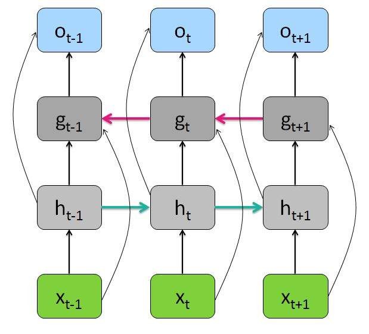

This blog post is about different Recurrent Neural Network architectures.

## Bidirectional RNN

<strong>caption</strong>

## Deep RNN

## Attention

# More posts:
[Implement a Recurrent Neural Network in R](https://markdumke.github.io/2016/12/29/implement-a-recurrent-neural-network-in-r.html)


