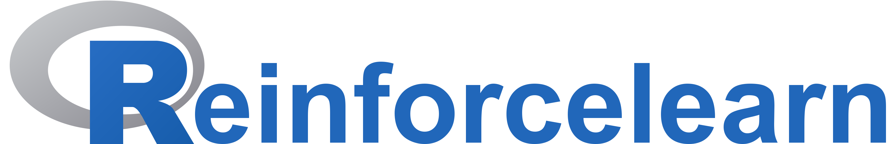

 

# Markus Dumke

---

## Education

- 2015 - 2017 Master Statistics LMU Munich
- 2012 - 2015 Bachelor Statistics LMU Munich

---

## Skills

### Statistics

- Statistical modeling
- Classification and regression (GLMs)
- Machine learning (Trees, Random Forests, Neural Networks, Boosting)
- Deep learning (Feedforward, Recurrent and Convolutional Networks)
- Reinforcement learning
- Unsupervised learning (Clustering, PCA, outlier detection)
- Functional data
- Mixed Models (longitudinal data)
- Categorical data analysis (contingency tables)
- Data preprocessing

### Software

- R, Python, (Matlab)

### Statistical reports and visualization

- R Markdown, Shiny, LaTeX
- ggplot, matplotlib

### Languages

- Deutsch, English

---

### R Packages

-  <a href="https://github.com/markdumke/reinforcelearn" style="padding-left:10px;"></a>

---

### Publications

- Reinforcement Learning in R (Master thesis)
- Asymmetric Correlations in Financial Returns (Bachelor thesis)

---

Have a look at my github page: <a href="https://github.com/markdumke" style="padding-left:10px;"></a>
