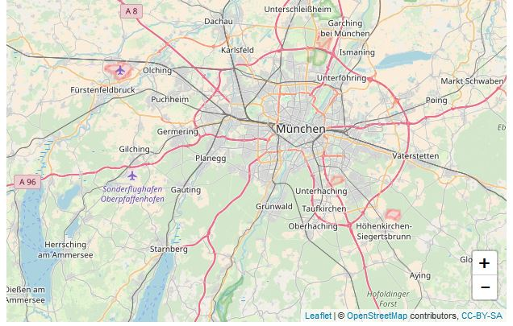

```{r setup, include = FALSE}
knitr::opts_chunk$set(eval = FALSE)
```

<br>

# Customize leaflet map in R with HTML, CSS and Javascript

This blog post shows examples of how to customize a leaflet map with javascript, html and css.

## Put leaflet zoom control in lower right of map

Here is a simple leaflet map in a shiny app, where we move the zoom control (+ - symbol) from the upper left to the lower right of the map. In the `ui.R` file we will hide the original zoom control by setting the CSS attribute `visibility` to `hidden`.

```{r}
library(shiny)
library(leaflet)
library(htmlwidgets)

ui <- fluidPage(
  tags$head(
    tags$style(HTML("
      .leaflet-left .leaflet-control{
        visibility: hidden;
      }
    "))
  ),
  leafletOutput("map", height = "400px")
)
```

In the `server.R` we can then add a leaflet zoom control with Javascript, here we specify the position as `'bottomright'`.

```{r}
server <- function(input, output) {
  output$map <- renderLeaflet({
    leaflet() %>% addTiles() %>% setView(11.5, 48.1, 10) %>%
      onRender(
        "function(el, x) {
          L.control.zoom({
            position:'bottomright'
          }).addTo(this);
        }")
  })
}

shinyApp(ui, server)
```

<center></center>
