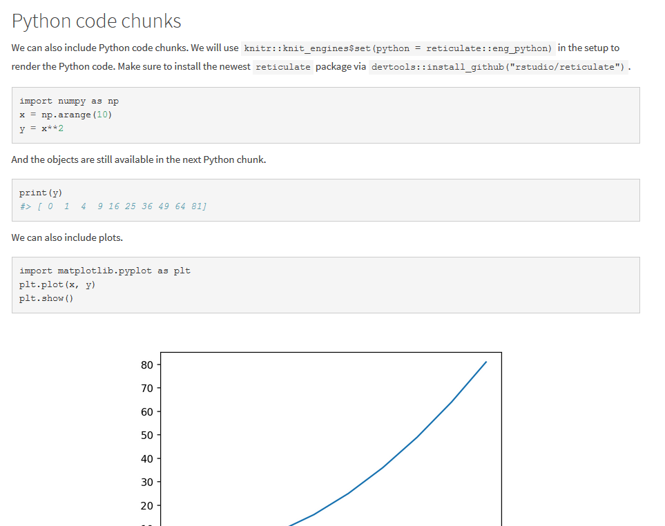
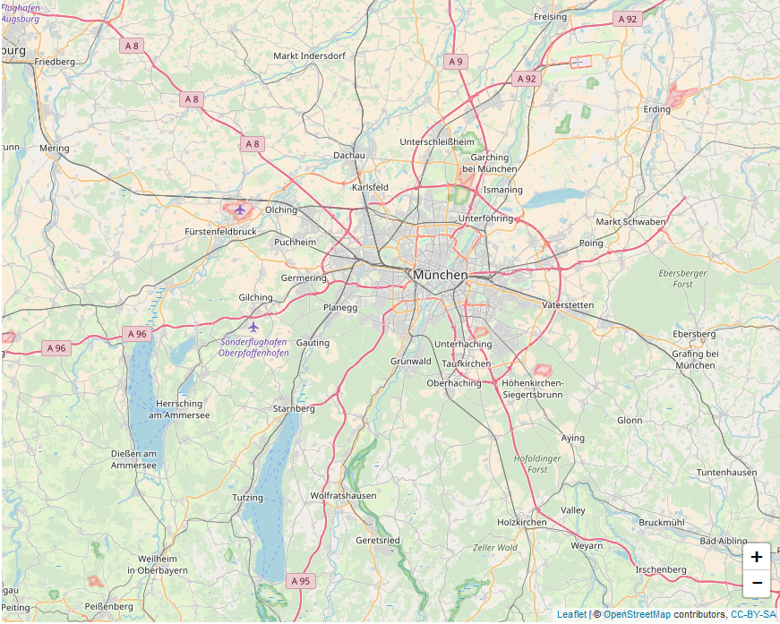

---
output:
  html_document:
    toc_float: false
---
 

<!--html_preserve-->

  

    
Statistics + Data Visualization

    
Articles about Statistics and Data Visualization with R, Shiny, R Markdown, ggplot, Python, matplotlib and more.

    

    

        
        <a href="r_and_python_in_rmarkdown.html" class="galleryItemLabel">Intermingle R and Python in R Markdown</a>
        
R Markdown, R, Python

      

      

        
        <a href="matplotlib_like_ggplot.html" class="galleryItemLabel">Make matplotlib look like ggplot</a>
        
R, ggplot, Python, matplotlib

      

      

        
        <a href="customize_leaflet_in_r_with_js.html" class="galleryItemLabel">Customize leaflet map in R with HTML</a>
        
R, leaflet, shiny, HTML, javacript, css

      

    

  

<!--/html_preserve-->

<!--html_preserve-->
<!--

  

    
Machine Learning

    
Articles about Machine Learning, Deep Learning and Reinforcement Learning.

    

      

        
        <a href="reinforcement_learning_in_r.html" class="galleryItemLabel">Reinforcement Learning in R</a>
        
I'm happy to announce that the reinforcelearn package is now available on CRAN! It offers lots of reinforcement learning environments and algorithms...

      

    

  

-->

<!--/html_preserve-->
